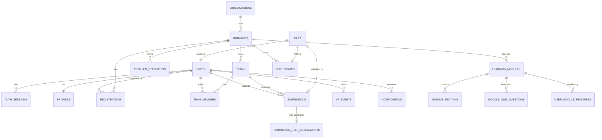

# H2S Database Schema — Innovator Dashboard

Written for: a backend engineer (or Claude session) implementing the Go API. This is the single source of truth for the database — a clean, standalone pull-together of the schema scattered across [BACKEND_ARCHITECTURE.md](BACKEND_ARCHITECTURE.md) and [H2S-Innovator-Dashboard-Backend.md](H2S-Innovator-Dashboard-Backend.md), grounded against the actual frontend code (`src/dashboard/`, `src/pages/Auth.jsx`, `src/api/mock/`) and the agreed API contracts (`api_req/dashboard.md`, `api_req/profile.md`), not guessed from feature names.

**Scope: Innovator Dashboard only.** Mentor (application, console, "Mentor Connect") and Arena/PromptWars are excluded entirely — not stubbed, not deferred-with-placeholder-tables. See the other two docs for why.

**Engine & conventions**: PostgreSQL, `uuid` primary keys (`gen_random_uuid()`, `pgcrypto`), `timestamptz` for every timestamp, `citext` for email. Built to sit under golang-migrate + sqlc.

---

## 1. How this schema is organized

Every table below exists because a real, already-shipped piece of the frontend needs it — each domain section says which component/store it backs. Two rules decided when something got its **own table** versus folding into an existing one or not existing at all:

- **A table earns its own row-per-record shape when it's independently created, updated, or deleted from its parent** — a session you can revoke, a profile section item you can edit, a submission that outlives the initiative's other data. That independence is what "separate table" means here — not "this concept sounds important."
- **A table does NOT get created when the same information is cheaply derivable from other tables, or when nothing in the frontend actually writes to it yet.** §9 lists every one of these calls explicitly, since "why isn't X a table" is exactly the kind of question a schema review should answer up front.

---

## 2. Entity overview



Deliberately simplified — profile section tables (education, projects, publications, …), auth's token tables, and a few lookup tables are omitted here for readability. Full detail in §3–§8.

---

## 3. Auth & account

Backs `src/pages/Auth.jsx` (password login, OTP login, signup) and `src/dashboard/Settings.jsx` (the 5-box production Settings page: email change, password change, session management, deactivate, delete).

```sql
create extension if not exists pgcrypto;

create type user_status as enum ('active', 'deactivated', 'deleted');

create table users (
  id                uuid primary key default gen_random_uuid(),
  email             citext unique not null,
  email_verified_at timestamptz,
  password_hash     text not null,               -- argon2id encoded hash, never plaintext
  name              text not null,
  mobile            text,                        -- "+91 98765 43210" — country code + number as one string, matching Auth.jsx's signup form
  headline          text,
  org               text,
  region            text,
  avatar_file_id    uuid references files(id),    -- added in a later migration, see §1 note below
  is_public         boolean not null default false,
  status            user_status not null default 'active',
  created_at        timestamptz not null default now(),
  updated_at        timestamptz not null default now(),
  deactivated_at    timestamptz,
  deleted_at        timestamptz                  -- soft delete; a scheduled job hard-purges past the retention window
);
create index on users (status) where deleted_at is null;

-- One row per device/browser session — backs Settings' "Manage Active Sessions" list AND
-- per-session revoke. This can't be a stateless-JWT-only design: "list my sessions and let me
-- kill one" requires a server-side record to kill.
create table auth_sessions (
  id                 uuid primary key default gen_random_uuid(),
  user_id            uuid not null references users(id),
  refresh_token_hash text not null unique,        -- sha256 of the opaque refresh token, never the raw token
  device_label       text,                        -- e.g. "Windows • Chrome"
  ip                 inet,
  user_agent         text,
  created_at         timestamptz not null default now(),
  last_active_at     timestamptz not null default now(),
  revoked_at         timestamptz
);
create index on auth_sessions (user_id) where revoked_at is null;

-- One-time codes for every code/link Auth.jsx sends: signup email verification, passwordless
-- login ("Log in with OTP instead"), AND forgot-password's "reset link" — that link is the same
-- one-time-token idea as the other two, just delivered as a URL token instead of a typed 6-digit
-- code, so it reuses this table under purpose='password_reset' rather than getting its own
-- near-identical password_reset_requests table.
create type otp_purpose as enum ('signup_verify', 'login', 'password_reset');

create table otp_codes (
  id            uuid primary key default gen_random_uuid(),
  user_id       uuid not null references users(id),
  purpose       otp_purpose not null,
  code_hash     text not null,             -- sha256(code) — the raw 6-digit code is never stored
  expires_at    timestamptz not null,       -- now() + 10 minutes (signup/login), + 1 hour (password_reset)
  attempt_count int not null default 0,     -- 5 wrong guesses locks the code, forces a fresh request
  consumed_at   timestamptz,
  created_at    timestamptz not null default now()
);
create index on otp_codes (user_id, purpose) where consumed_at is null;

-- Backs Settings' "Change Email Address" pending-verification flow (password-gated request →
-- emailed link → pending state with masked email + resend cooldown).
create table email_change_requests (
  id          uuid primary key default gen_random_uuid(),
  user_id     uuid not null references users(id),
  new_email   citext not null,
  token_hash  text not null unique,
  expires_at  timestamptz not null,
  verified_at timestamptz,
  created_at  timestamptz not null default now()
);
create index on email_change_requests (user_id) where verified_at is null;

-- Every security-sensitive account action Settings.jsx exposes as a distinct, deliberate user
-- action: email change requested/verified, password changed, deactivated, deleted, session
-- revoked, OTP login. The backend must treat them as distinct too — this table is where that shows up.
create table audit_logs (
  id         uuid primary key default gen_random_uuid(),
  user_id    uuid references users(id),           -- the account affected
  actor_id   uuid references users(id),            -- who did it (= user_id except for a future admin action)
  action     text not null,                        -- 'email_change_requested' | 'password_changed' | 'deactivated' | 'deleted' | 'session_revoked' | 'otp_login' | ...
  metadata   jsonb not null default '{}',
  ip         inet,
  created_at timestamptz not null default now()
);
create index on audit_logs (user_id, created_at desc);
```

---

## 4. Files

Object storage metadata only — bytes live in S3/MinIO, never in Postgres. Backs avatar upload, submission attachments, self-reported certificate proof images, and generated certificate PDFs.

```sql
create type file_kind as enum ('avatar', 'cert_proof', 'submission_attachment', 'certificate_pdf');

create table files (
  id            uuid primary key default gen_random_uuid(),
  owner_user_id uuid references users(id),
  kind          file_kind not null,
  storage_key   text not null,          -- S3/MinIO object key
  content_type  text not null,
  size_bytes    bigint not null,
  created_at    timestamptz not null default now()
);
```

**Migration-order note**: `users.avatar_file_id` references `files`, and `files.owner_user_id` references `users` — a real circular dependency. In practice: create `users` without `avatar_file_id` → create `files` → `alter table users add column avatar_file_id ...` in a third migration. Expand/contract, never a single migration trying to create both at once.

---

## 5. Profile

Backs the full Profile object contract in `api_req/profile.md` — one table per independently-editable section, matching the frontend's own Add/Edit/Delete-per-item CRUD model exactly.

```sql
create table profiles (
  user_id       uuid primary key references users(id),
  cover_file_id uuid references files(id),
  about         text,
  links         text,                              -- personal site / portfolio URL
  skills        text[] not null default '{}',       -- freeform, GIN-indexed
  interests     text[] not null default '{}',       -- constrained to `areas` at the app layer
  domains       text[] not null default '{}',       -- constrained to `areas` at the app layer
  landing_view  text not null default 'learning',   -- 'learning' | 'learncompete' | 'competing'
  contributions jsonb not null default '{}',         -- { github: "...", stackoverflow: "..." } — likely to grow platforms
  updated_at    timestamptz not null default now()
);
create index on profiles using gin (skills);
create index on profiles using gin (interests);
create index on profiles using gin (domains);

-- Canonical vocabulary `profiles.interests`/`domains` and `initiatives.areas` (§6) both draw
-- from — matches AREAS in src/dashboard/data.js. Exists purely to validate against, not to join
-- against (see §9 for why these stay arrays, not a join table).
create table areas (
  name text primary key
);

create table profile_education (
  id                  uuid primary key default gen_random_uuid(),
  user_id             uuid not null references users(id),
  degree              text not null,
  specialization      text,
  institution         text,
  board_or_university text,
  location            text,
  start_year          text,
  end_year            text,
  is_ongoing          boolean not null default false,
  sort_order          int not null default 0
);

create table profile_projects (
  id              uuid primary key default gen_random_uuid(),
  user_id         uuid not null references users(id),
  title           text not null,
  tech_stack      text[] not null default '{}',
  description     text,
  source_code_url text,
  demo_url        text,
  docs_url        text,
  sort_order      int not null default 0
);

create table profile_publications (
  id          uuid primary key default gen_random_uuid(),
  user_id     uuid not null references users(id),
  title       text not null,
  description text,
  link        text,
  sort_order  int not null default 0
);

create table profile_achievements (
  id          uuid primary key default gen_random_uuid(),
  user_id     uuid not null references users(id),
  title       text not null,
  description text,
  sort_order  int not null default 0
);

-- "selfCerts" in the frontend — user-reported external certifications, distinct from the
-- platform-issued `certificates` in §7 (one is a claim the user types in, the other is proof
-- the platform generated itself; conflating them would let a user fake a completion certificate).
create table profile_self_certifications (
  id            uuid primary key default gen_random_uuid(),
  user_id       uuid not null references users(id),
  title         text not null,
  org           text,
  issued_on     text,                                -- kept as the frontend's free-text "YYYY-MM", not a real date
  link          text,
  proof_file_id uuid references files(id),
  sort_order    int not null default 0
);

create table profile_connected_profiles (
  id         uuid primary key default gen_random_uuid(),
  user_id    uuid not null references users(id),
  platform   text not null,
  url        text not null,
  sort_order int not null default 0
);
create index on profile_education (user_id);
create index on profile_projects (user_id);
create index on profile_publications (user_id);
create index on profile_achievements (user_id);
create index on profile_self_certifications (user_id);
create index on profile_connected_profiles (user_id);
```

---

## 6. Organizations & initiatives

Backs the catalog (Learn/Build/Compete), initiative detail, registration, save/unsave, and recently-viewed — `src/dashboard/data.js`'s `INITIATIVES` shape and `api_req/dashboard.md`.

```sql
create type initiative_purpose as enum ('learning', 'learncompete', 'competing');
create type initiative_status  as enum ('upcoming', 'live', 'past');
create type initiative_mode    as enum ('virtual', 'hybrid', 'in_person');

create table organizations (
  id           uuid primary key default gen_random_uuid(),
  name         text not null,
  slug         text unique not null,
  logo_file_id uuid references files(id),
  created_at   timestamptz not null default now()
);

create table initiatives (
  id          uuid primary key default gen_random_uuid(),
  org_id      uuid not null references organizations(id),
  slug        text unique not null,
  name        text not null,
  purpose     initiative_purpose not null,
  status      initiative_status not null default 'upcoming',
  region      text not null,
  mode        initiative_mode not null,
  areas       text[] not null default '{}',        -- GIN-indexed, matches areas.name (§5)
  prize_text  text,
  deadline    timestamptz not null,
  blurb       text,
  created_at  timestamptz not null default now(),
  updated_at  timestamptz not null default now()
);
create index on initiatives using gin (areas);
create index on initiatives (status, purpose, deadline);
create index on initiatives (region);
-- status (upcoming→live→past) is deadline-driven; a scheduler flips it on a cron tick rather
-- than every catalog read recomputing it — keeps that query a plain index scan.

create table problem_statements (
  id            uuid primary key default gen_random_uuid(),
  initiative_id uuid not null references initiatives(id),
  code          text not null,                    -- e.g. "PS-138"
  title         text not null,
  description   text,
  unique (initiative_id, code)
);

create table registrations (
  id            uuid primary key default gen_random_uuid(),
  initiative_id uuid not null references initiatives(id),
  user_id       uuid not null references users(id),
  registered_at timestamptz not null default now(),
  unique (initiative_id, user_id)
);
create index on registrations (user_id);

create table saved_initiatives (
  user_id       uuid not null references users(id),
  initiative_id uuid not null references initiatives(id),
  saved_at      timestamptz not null default now(),
  primary key (user_id, initiative_id)
);

-- Capped to "last 12 viewed" at the query layer (ORDER BY viewed_at DESC LIMIT 12), not by
-- deleting rows — the full history stays available if that cap ever changes.
create table recent_views (
  user_id       uuid not null references users(id),
  initiative_id uuid not null references initiatives(id),
  viewed_at     timestamptz not null default now(),
  primary key (user_id, initiative_id)
);
create index on recent_views (user_id, viewed_at desc);
```

---

## 7. Teams, submissions & learning

Backs the initiative workspace (`src/dashboard/Workspace.jsx`): team join, problem-statement selection, prototype submission, self-assessment, module syllabus, quiz, and certificate claim.

```sql
create type team_role         as enum ('leader', 'member');
create type submission_status as enum ('draft', 'submitted', 'under_review', 'scored');
create type module_kind       as enum ('video', 'reading', 'lab');

create table teams (
  id            uuid primary key default gen_random_uuid(),
  initiative_id uuid not null references initiatives(id),
  name          text not null,
  created_at    timestamptz not null default now()
);

create table team_members (
  team_id   uuid not null references teams(id),
  user_id   uuid not null references users(id),
  role      team_role not null default 'member',
  joined_at timestamptz not null default now(),
  primary key (team_id, user_id)
);
create index on team_members (user_id);

create table submissions (
  id                   uuid primary key default gen_random_uuid(),
  initiative_id        uuid not null references initiatives(id),
  team_id              uuid references teams(id),          -- nullable: solo submissions are allowed
  problem_statement_id uuid references problem_statements(id),
  submitted_by         uuid not null references users(id),
  title                text,
  repo_url             text,
  demo_url             text,
  notes                text,
  attachment_file_id   uuid references files(id),          -- single optional attachment, ≤2MB
  status               submission_status not null default 'draft',
  submitted_at         timestamptz,
  created_at           timestamptz not null default now(),
  updated_at           timestamptz not null default now(),
  deleted_at           timestamptz
);
create index on submissions (initiative_id, status);
create index on submissions (team_id);

-- The innovator scores their OWN submission against the rubric (RUBRIC in data.js —
-- ['Problem fit', 'Technical execution', 'Innovation', 'Presentation'], 0-10 each) via
-- Workspace.jsx's "Open evaluation" → Evaluate.jsx, keyed by SELF_KEY = initiative_id + '::self'.
-- Not cosmetic: reachedFor() in data.js gates the innovator's own journey progress on whether
-- this row exists, so it's a real write, not a client-only flag. (Separate from mentor judging
-- of the same rubric, which is out of scope — no judging_scores table in this build.)
create table submission_self_assessments (
  id            uuid primary key default gen_random_uuid(),
  submission_id uuid not null references submissions(id),
  user_id       uuid not null references users(id),
  rubric        jsonb not null,        -- { "Problem fit": 8, "Technical execution": 7, ... }
  total         int not null,          -- sum of the 4 rubric scores, denormalized — the journey-gate check reads it constantly
  note          text,
  created_at    timestamptz not null default now(),
  unique (submission_id, user_id)
);

create table learning_modules (
  id            uuid primary key default gen_random_uuid(),
  initiative_id uuid not null references initiatives(id),
  idx           int not null,
  title         text not null,
  kind          module_kind not null,
  content_url   text,
  unique (initiative_id, idx)
);

create table module_sections (
  id        uuid primary key default gen_random_uuid(),
  module_id uuid not null references learning_modules(id),
  idx       int not null,
  title     text not null,
  body      text,
  unique (module_id, idx)
);

create table module_quiz_questions (
  id            uuid primary key default gen_random_uuid(),
  module_id     uuid not null references learning_modules(id),
  idx           int not null,
  question      text not null,
  options       jsonb not null,       -- ["opt a", "opt b", ...]
  correct_index int not null,
  unique (module_id, idx)
);

create table user_module_progress (
  user_id       uuid not null references users(id),
  module_id     uuid not null references learning_modules(id),
  sections_done int[] not null default '{}',
  quiz_answers  jsonb,
  completed_at  timestamptz,
  primary key (user_id, module_id)
);

create table certificates (
  id            uuid primary key default gen_random_uuid(),
  user_id       uuid not null references users(id),
  initiative_id uuid not null references initiatives(id),
  cert_number   text unique not null,
  file_id       uuid references files(id),
  issued_at     timestamptz not null default now(),
  unique (user_id, initiative_id)
);
-- "Pending certificate" (Profile's All Certs page) is derived, not stored: a finished initiative
-- the user registered for with no matching row here yet.
```

---

## 8. Gamification & notifications

```sql
-- XP events, not a mutable xp column — see §9 for why. Powers the Profile object's
-- xp/level/badges, computed in Go the same way levelFor()/badgesFor() do in data.js today.
create type xp_event_kind as enum ('registered', 'submission', 'certificate', 'hat_earned', 'profile_complete');

create table xp_events (
  id         uuid primary key default gen_random_uuid(),
  user_id    uuid not null references users(id),
  kind       xp_event_kind not null,
  ref_id     uuid,                     -- the initiative/submission/certificate this event came from
  points     int not null,
  created_at timestamptz not null default now(),
  unique (user_id, kind, ref_id)       -- idempotent: the same achievement never scores twice
);
create index on xp_events (user_id);

-- Notification feed (the bell icon — src/dashboard/Shell.jsx's notesFor()/unreadFor()).
create table notifications (
  id         uuid primary key default gen_random_uuid(),
  user_id    uuid not null references users(id),
  type       text not null,
  payload    jsonb not null default '{}',
  read_at    timestamptz,
  created_at timestamptz not null default now()
);
create index on notifications (user_id, created_at desc) where read_at is null;
```

---

## 9. What deliberately isn't a table

Answering "why doesn't X have its own table" up front, since a schema review always asks:

| Would-be table | Why it isn't one |
|---|---|
| `notification_prefs` | `Settings.jsx` dropped its notification-toggle UI entirely ("No tabs, no Notifications/Privacy/Preferences — out of scope"). Nothing writes to this today. Add it back alongside the UI that needs it, not before. |
| `password_reset_requests` | Forgot-password's "reset link" is the same one-time-token concept as signup verification and OTP login — it reuses `otp_codes` with `purpose = 'password_reset'` instead of a fourth near-identical token table. |
| `user_xp` / `user_level` / `user_badges` | All three are pure functions of `xp_events` (+ `registrations`, `certificates`) — computed on read, exactly like `xpFor()`/`levelFor()`/`badgesFor()` in `data.js` today. A stored counter can drift from its own history; a derived read cannot. |
| `pending_certificates` | A finished initiative the user registered for with no `certificates` row — a query, not a table. |
| `areas_join` (initiative↔area, profile↔area many-to-many) | `areas`/`interests`/`domains`/`skills` are small, low-cardinality, filter-only vocabularies. A `text[]` column with a GIN index answers every real query ("initiatives tagged AI/GenAI") without an extra join — a join table would cost a table and a join for nothing a GIN index doesn't already give. |
| `regions` (lookup table) | 8 static values, single-valued per initiative. A `text` column is enough; a table would be one join for a value that never needs its own foreign-key integrity check. |
| `mentor_applications`, `mentor_assignments`, `judging_scores` | Mentor is out of scope for this build entirely (§ Scope). Not stubbed — genuinely absent. |
| `arena_*` (drops, entries, submissions, ledger, store) | Arena/PromptWars is out of scope for this build entirely (§ Scope). |
| `contributions` as its own table | Two optional key/value pairs (`github`, `stackoverflow` usernames) that are likely to grow platforms over time — a `jsonb` column on `profiles` fits without a migration every time a new platform is added, and nothing queries across users by contribution platform today. |

---

## 10. Index summary

Every FK column and every column driving a `WHERE`/`ORDER BY` on a list endpoint has an index, per the golden rule in [BACKEND_ARCHITECTURE.md](BACKEND_ARCHITECTURE.md#3-golden-rules). Quick reference:

| Table | Index | Backs |
|---|---|---|
| `users` | `(status) where deleted_at is null` | Active-user lookups excluding soft-deleted rows |
| `auth_sessions` | `(user_id) where revoked_at is null` | Settings' session list |
| `otp_codes` | `(user_id, purpose) where consumed_at is null` | OTP verify lookup |
| `email_change_requests` | `(user_id) where verified_at is null` | Pending-verification check |
| `audit_logs` | `(user_id, created_at desc)` | Account activity history |
| `profiles` | GIN on `skills`, `interests`, `domains` | Skill/interest search & catalog matching |
| `profile_*` (6 tables) | `(user_id)` | Loading one user's full profile |
| `initiatives` | GIN on `areas`; `(status, purpose, deadline)`; `(region)` | Catalog filtering |
| `registrations` | `(user_id)` | "My registered initiatives" |
| `recent_views` | `(user_id, viewed_at desc)` | Recently-viewed list, capped at 12 |
| `submissions` | `(initiative_id, status)`; `(team_id)` | Submission listing, team roster lookup |
| `team_members` | `(user_id)` | "My teams" |
| `xp_events` | `(user_id)` | XP total computation |
| `notifications` | `(user_id, created_at desc) where read_at is null` | Unread notification feed |

---

## 11. Companion docs

- [BACKEND_ARCHITECTURE.md](BACKEND_ARCHITECTURE.md) — the PDF gap review and the 13 golden rules this schema follows.
- [H2S-Innovator-Dashboard-Backend.md](H2S-Innovator-Dashboard-Backend.md) — directory layout, chi router, sqlc config, Redis/RabbitMQ usage, `main.go` wiring.
- [api_req/dashboard.md](api_req/dashboard.md), [api_req/profile.md](api_req/profile.md) — the frontend API contracts this schema serves.
